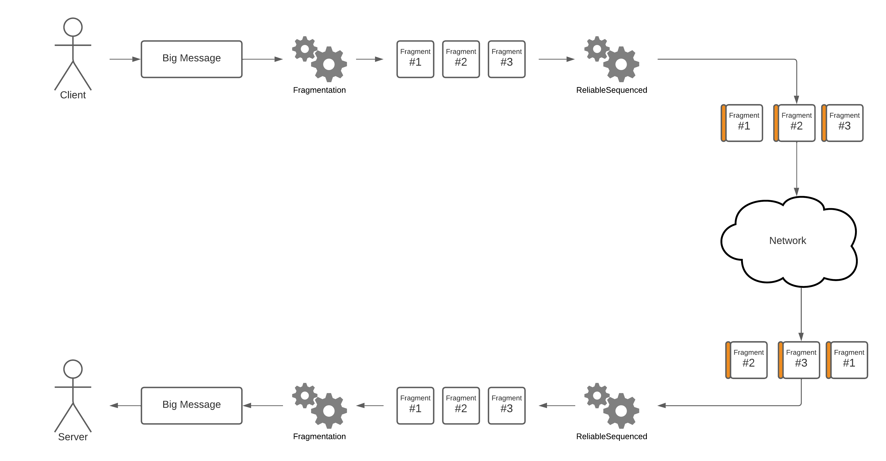

# Using pipelines

Pipelines are a core functionality of Unity Transport that allows selectively adding layers of functionality on top of the standard unreliable datagrams provided by default. Features such as sequencing, reliability, and fragmentation are possible using pipelines.

## How it works

Pipelines are defined as a sequence of one or more *stages*. When a message is sent through a pipeline, it is run through the stages in order, the output of the first stage being piped in the second stage and so on. So if the first stage adds a header to the packet, then the second stage will process the entire packet including this header. When a message is received, it goes through the chain of stages, but in the reverse order.


Let's consider an example. `FragmentationPipelineStage` allows breaking large messages in smaller pieces, and `ReliableSequencedPipelineStage` allows sending messages with guaranteed order and delivery. If you wanted to create a pipeline that offers the functionality of both, you could create one as follows:

```csharp
// In initialization code, before any connections are made.
var myPipeline = driver.CreatePipeline(
    typeof(FragmentationPipelineStage), typeof(ReliableSequencedPipelineStage));
```

This will create a pipeline where messages are first fragmented in smaller pieces that each fit in a packet, and where each piece will then be delivered reliably and in the correct order. The process is illustrated below. The small orange pieces on the fragments represent sequence numbers and other information added by the reliable stage.



Note that the order of the stages is important here. If we had reversed the order, then the reliability information would have been added only to the larger unfragmented message. This would have been less bandwidth-efficient since losing any single fragment would have resulted in the entire unfragmented message needing to be resent. By ordering the reliable stage after fragmentation, then losing a single fragment will only result in that fragment being resent.

To send a message on this new pipeline, you can pass it to `BeginSend`:

```csharp
driver.BeginSend(myPipeline, connection, out var writer);
```

To know on which pipeline a message was received, the last argument of `PopEvent`/`PopEventForConnection` can be used:

```csharp
var eventType = driver.PopEvent(out _, out _, out var receivePipeline);
if (eventType == NetworkEvent.Type.Data)
{
    // Data message was received on the receivePipeline pipeline.
}
```

**Note**: Pipelines should always be configured the same way on the server and client. That is, the `CreatePipeline` calls (and their order) should match on both ends of a connection. Unity Transport will not protect you against this, so we recommend sharing any pipeline-creation code between the server and client.

## The fragmentation pipeline stage

By default Unity Transport can only send messages that will fit into the [MTU](https://en.wikipedia.org/wiki/Maximum_transmission_unit) (roughly 1400 bytes). To send larger messages, they must be split in smaller pieces. This is called *message fragmentation*.

Pipelines configured with a `FragmentationPipelineStage` will automatically fragment messages for you. The maximum payload size pre-fragmentation can be configured when creating a `NetworkDriver`:

```csharp
var settings = new NetworkSettings();
settings.WithFragmentationStageParameters(payloadCapacity: 10000);

var driver = NetworkDriver.Create(settings);
var fragmentedPipeline = driver.CreatePipeline(typeof(FragmentationPipelineStage));
```

The maximum value is about ~20MB. However, the pipeline stage is optimized for payloads of a few kilobytes only (the default value is 4096 bytes). We don't recommend sending messages much larger than that, except perhaps as a one-time thing at initialization. Furthermore, if this pipeline stage is used in conjunction with the `ReliableSequencedPipelineStage` (see below), then the maximum is value is even lower at around 88KB.

**Note**: When creating a pipeline with multiple stages, `FragmentationPipelineStage` should normally be the *first* in the chain. This is because many pipeline stages do not support packets larger than the MTU.

## The reliable pipeline stage

Pipelines configured with a `ReliableSequencedPipelineStage` will guarantee the delivery and order of their packets, similarly to how a [TCP](https://en.wikipedia.org/wiki/Transmission_Control_Protocol) connection would. Packets are tagged with a sequence number, and peers will acknowledge the reception of these numbers. If a packet is not acknowledged, it will be resent until it is received. If a packet arrives out of order, it is buffered until previous packets are received.

This is a useful feature, but in a multiplayer game context it should be used sparingly. Reliable data streams can suffer from [head-of-line blocking](https://en.wikipedia.org/wiki/Head-of-line_blocking), which can cause increased latency and delay packet processing. We recommend using this pipeline stage only for very important traffic that you can't afford to lose (like RPCs and character actions).

### Maximum number of packets in flight

The reliable stage is limited in the number of packets in flight at any given time. The default limit is 32, but can be increased. This limit is per connection and per pipeline (it's not shared across all connections).

Because of this limitation, it's recommend to batch reliable messages together as much as possible. For example, instead of sending two reliable messages of 20 bytes each, concatenate them and send a single message of 40 bytes.

If you attempt to send a new reliable message while there are already the maximum number in flight, `EndSend` will return error code `NetworkSendQueueFull` (value -5). If this happens, you can store the message in a queue until it's possible to send again:

```csharp
driver.BeginSend(myReliablePipeline, connection, out var writer);
// Write your message to the writer.
if (driver.EndSend(writer) == (int)Error.StatusCode.NetworkSendQueueFull))
{
    // Copy your message to a queue, and try resending later.
}
```

### Increasing the limit

It's recommended to use the reliable pipeline only when strictly necessary. The limit of 32 packets in flight should be sufficient for most use cases. However, if you find you need to increase it, this can be done when creating a `NetworkDriver`:

```csharp
var settings = new NetworkSettings();
settings.WithReliableStageParameters(windowSize: 256);

var driver = NetworkDriver.Create(settings);
var reliablePipeline = driver.CreatePipeline(typeof(ReliableSequencedPipelineStage));
```

The default limit is 32, and the maximum is technically 2040, although a maximum of 256 is the *strongly* recommended value. The reason to avoid going higher is that resend buffers are pre-allocated, thus higher values will result in increased memory usage (especially on servers that handle many connections). Furthermore, since any packet needs to possibly include acknowledgement information for the entire window, high values can also have an impact on bandwidth efficiency (how much useful data can be sent per packet).

Note also that both client and server need to be configured with the same value. Trying to increase the value on only one end of the connection will result in incompatibilities that might prevent reliable traffic from being correctly delivered.

### Circumventing the limit with multiple pipelines

If your application has different streams of data that require reliability and sequencing, but the ordering of messages between the streams doesn't matter, then you can circumvent the limit of packets in flight by creating multiple reliable pipelines (because the limit is both per connection and per pipeline). This can be an alternative (or a supplement) to increasing the window size.

For example, you could create a pipeline for RPCs and another one for chat messages:

```csharp
var rpcPipeline = driver.CreatePipeline(typeof(ReliableSequencedPipelineStage));
var chatPipeline = driver.CreatePipeline(typeof(ReliableSequencedPipelineStage));
```

Each pipeline has its own limit of 32 or more messages in flight. Note, however, that ordering between the two pipelines isn't guaranteed, so sending a message on `rpcPipeline` and then sending a message on `chatPipeline` doesn't mean that the RPC will be delivered first.

## The simulator pipeline stage

The `SimulatorPipelineStage` is meant to be used when testing your application. It allows simulating different network conditions like packet loss, delay, and jitter. This is useful to know how a game would behave once deployed in a real environment.

The network conditions can be configued when creating a `NetworkDriver`:

```csharp
var settings = new NetworkSettings();
settings.WithSimulatorStageParameters(
    maxPacketCount: 100,
    mode: ApplyMode.AllPackets,
    packetDelayMs: 50);

var driver = NetworkDriver.Create(settings);
var simulatorPipeline = driver.CreatePipeline(typeof(SimulatorPipelineStage));
```

Noteworthy parameters are:

- `maxPacketCount`: The number of packets that can be delayed at any given time. Past that, packets will go through without any delay added.
- `mode`: In which direction the simulator should apply the network conditions (send, receive, or both).
- `packetDelayMs`: Delay in milliseconds to be applied to packets. Good values to use would go from 20 for a good broadband connection, up to 200 for bad mobile connections.
- `packetJitterMs`: Deviation around the delay. Typically half of the delay or slightly less.
- `packetDropPercentage`: Percentage of packets to drop. This should rarely be above 3 even for bad mobile connections.

**Note**: When creating a pipeline with multiple stages, `SimulatorPipelineStage` should normally be the *last* in the chain. Otherwise packets could be dropped before they are processed by the other stages (not very useful for a reliable pipeline, for example).
